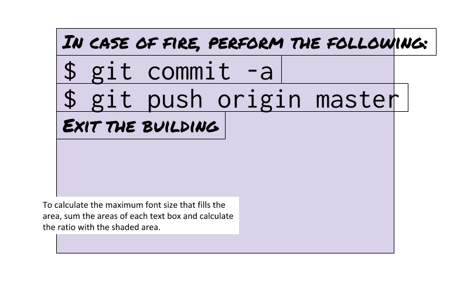

# rg-quotations
Quotations in computing based on a file by Ria Galanos. Each quotation is designed to be printed as a classroom poster. These quotations have been augmented by ones from my [teaching](http://j.mp/psb_david_petty), [AZQuotes](https://azquotes.com/quotes/topics/computer-science.html), [adafruit quotations](https://adafruit.com/quotes) (one of which is shipped in every box!), and other [Googleable](https://lmgtfy.app/?q=computer+science+quotations) quotation sites.

## `font-size` property

In addition, this was a chance to use [JavaScript](https://www.ecma-international.org/publications/standards/Ecma-262.htm) to adjust the `font-size` property of each quotation to fill a rectangle of a fixed size. This is accomplished by the [`get_text_size`](https://stackoverflow.com/questions/31305071/measuring-text-width-height-without-rendering) function using an HTML [`canvas`](https://developer.mozilla.org/en-US/docs/Web/API/HTMLCanvasElement/getContext) element to calcuate the areas of each line of text of each section in a certain font at a certain size and then scales the `font-size` property to fill the area of the section. For example:

[&#128279; permalink](https://psb-david-petty.github.io/rg-quotations/) and [&#128297; repository](https://github.com/psb-david-petty/rg-quotations/) for this page.
